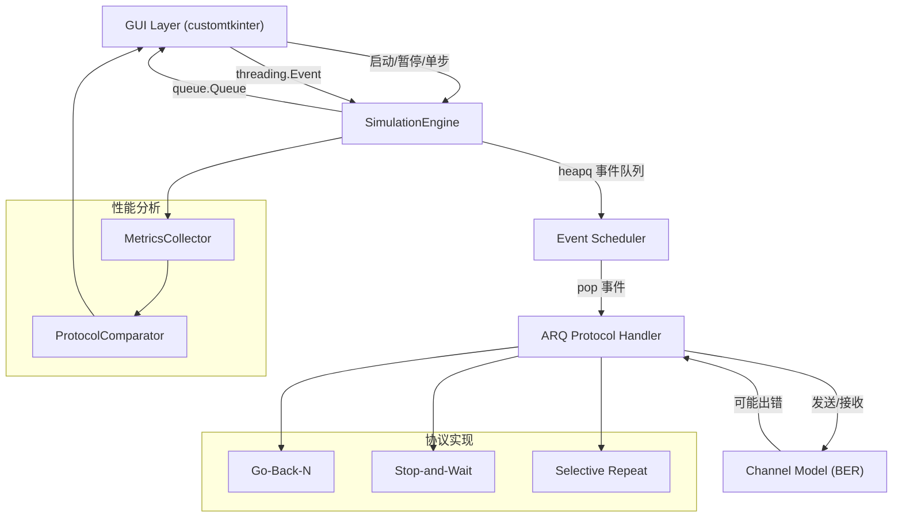

## 产品概述

构建一个基于 Python 的 Go-back-N (GBN) 差错控制机制教学实验平台，帮助学生在可视化界面中观察和理解 GBN ARQ 协议的完整工作流程，并与其他 ARQ 机制进行性能对比。

## 核心功能

- **平台界面**：基于 customtkinter 构建简洁美观的桌面 GUI，包含参数配置面板、可视化动画区域、控制按钮区和日志输出区
- **GBN 协议仿真**：完整实现数据分片、发送窗口、累计确认、超时重传、滑动窗口等 GBN 核心机制
- **错误注入与状态指示**：可配置比特错误率(BER)，传输出错时红灯指示并自动暂停，支持手动继续/单步执行
- **可视化动画**：实时显示发送窗口、接收窗口、数据包传输轨迹、ACK 反馈、超时事件等状态的动画
- **性能测试**：在不同窗口大小、BER、数据包数量等参数下测试吞吐量、重传次数、效率等指标
- **多协议对比**：支持 Stop-and-Wait ARQ 和 Selective Repeat ARQ 仿真，与 GBN 进行性能对比并生成对比图表

## 技术栈选择

- **语言**: Python 3.10+
- **UI 框架**: customtkinter（现代外观，轻量，无需 Qt 依赖）
- **绘图/动画**: matplotlib（嵌入 customtkinter，用于协议时序图和性能曲线）
- **数据处理**: numpy（性能数据统计计算）

## 实现方案

### 高层策略

采用模块化架构，将协议仿真引擎与 GUI 表现层分离。仿真引擎以事件驱动方式运行在独立线程中，通过线程安全的队列与 GUI 通信，避免界面卡顿。GUI 层负责参数输入、动画渲染和结果展示。

### 关键技术决策

1. **事件驱动仿真引擎**：使用 Python `heapq` 最小堆实现事件队列，支持离散事件仿真(DES)，时间复杂度 O(log N) 每事件
2. **多线程架构**：仿真引擎运行在后台线程，GUI 主线程通过 `after()` 轮询消息队列更新界面，避免仿真阻塞 UI
3. **customtkinter**：用户明确要求轻量方案，外观现代且 pip 安装即可
4. **matplotlib 嵌入 GUI**：用于绘制协议时序图和性能对比曲线，支持实时更新

### 性能与可靠性

- 仿真引擎事件队列 O(log N)，支持大规模数据包仿真（>10000 包）
- GUI 更新频率限制（100ms 节流），避免高频重绘导致卡顿
- 线程安全：使用 `queue.Queue` 进行引擎→GUI 通信，使用 `threading.Event` 进行 GUI→引擎控制

## 目录结构

```
/Users/mac/CodeBuddy/Digital Comms project/
├── main.py                          # [NEW] 程序入口，启动 GUI
├── requirements.txt                 # [NEW] 依赖清单 (customtkinter, matplotlib, numpy)
├── config/
│   └── default_config.py           # [NEW] 默认仿真参数常量
├── core/
│   ├── __init__.py
│   ├── event.py                    # [NEW] 离散事件仿真事件定义 (SimEvent dataclass)
│   ├── simulator.py                # [NEW] 仿真引擎核心（事件队列调度，run loop）
│   ├── channel.py                  # [NEW] 信道模型（BER 错误注入，packet corruption/drop）
│   └── packet.py                   # [NEW] 数据包/ACK 定义 (Packet, ACK dataclasses)
├── protocols/
│   ├── __init__.py
│   ├── base.py                     # [NEW] BaseARQ 抽象基类 (step, get_state 接口)
│   ├── go_back_n.py               # [NEW] GBN 协议实现 (发送方+接收方状态机)
│   ├── stop_and_wait.py           # [NEW] Stop-and-Wait 协议实现
│   └── selective_repeat.py        # [NEW] Selective Repeat 协议实现
├── gui/
│   ├── __init__.py
│   ├── app.py                      # [NEW] 主窗口 GBNLabApp 类 (布局管理, 线程桥接)
│   ├── widgets/
│   │   ├── __init__.py
│   │   ├── control_panel.py        # [NEW] 左侧控制面板 (参数滑块, 协议选择, 控制按钮)
│   │   ├── animation_canvas.py     # [NEW] 中央动画画布 (tkinter Canvas 绘制窗口/传输箭头)
│   │   ├── timeline_chart.py       # [NEW] 时序图 (matplotlib FigureCanvasTkAgg 嵌入)
│   │   ├── performance_panel.py     # [NEW] 右侧性能面板 (实时指标卡片 + 对比柱状图)
│   │   └── log_console.py          # [NEW] 底部日志控制台 (tk.Text + 滚动条, 彩色日志)
│   └── styles.py                   # [NEW] customtkinter 主题配置和颜色常量
├── analysis/
│   ├── __init__.py
│   ├── metrics.py                  # [NEW] 性能指标计算（吞吐量, 效率, 重传率, 平均延迟）
│   └── comparator.py               # [NEW] 多协议性能对比分析（运行多组参数, 汇总结果）
└── tests/
    ├── __init__.py
    ├── test_gbn.py                 # [NEW] GBN 协议单元测试
    ├── test_simulator.py           # [NEW] 仿真引擎测试
    └── test_comparator.py          # [NEW] 对比分析测试
```

## 核心代码结构

```python
# core/event.py
@dataclass(order=True)
class SimEvent:
    time: float          # 事件发生时间
    type: str            # PACKET_SENT / PACKET_RECEIVED / ACK_SENT / ACK_RECEIVED / TIMEOUT / ERROR
    packet_id: int       # 关联的数据包ID
    sender: str          # "sender" or "receiver"
```

```python
# protocols/base.py
class BaseARQ(ABC):
    @abstractmethod
    def step(self, event: SimEvent) -> List[SimEvent]:
        """处理一个事件，返回新产生的事件列表"""
        ...
    
    @abstractmethod
    def get_state(self) -> Dict:
        """返回当前协议状态快照（用于 GUI 渲染）"""
        ...
    
    @abstractmethod
    def reset(self) -> None:
        """重置协议状态，准备新一轮仿真"""
        ...
```

```python
# gui/app.py
class GBNLabApp(customtkinter.CTk):
    def __init__(self):
        # 三栏布局: 左control_panel(280px) / 中animation+timeline / 右performance(320px)
        # 底部: log_console(可折叠)
        ...
    
    def start_simulation(self):
        """启动后台仿真线程，传入当前配置"""
        ...
    
    def on_engine_message(self, msg: Dict):
        """通过 after(100ms) 调用，更新动画/图表/日志"""
        ...
```

## 架构设计

### 系统架构



### 数据流

1. GUI 配置参数 → 点击开始 → 启动 SimulationEngine 后台线程
2. Engine 初始化事件队列，注入首个 PACKET_SENT 事件
3. Scheduler 按时间弹出事件 → 调用协议 step() → 产生新事件插入队列
4. 每事件处理后，Engine 将状态快照放入 queue.Queue
5. GUI 主线程 after(100ms) 轮询队列 → 更新动画/图表/日志
6. 传输完成或出错 → Engine 发送 SIMULATION_COMPLETE / ERROR_PAUSE 事件
7. 用户查看性能面板或运行对比实验

## 实现注意事项

- **动画帧率**：限制 10 FPS（每 100ms 更新），大量数据包时不卡顿
- **日志**：最新 200 行，等宽字体，INFO/WARN/ERROR 分色显示
- **BaseARQ 接口稳定**：新增协议只需继承实现 step()/get_state()/reset()
- **参数校验**：GUI 层完成，引擎层对异常事件记录日志并继续

## 设计风格

采用现代深色主题教学实验平台设计。整体风格专业、清晰，适合教学演示场景。

### 布局设计（三栏 + 底栏）

**1. 顶部标题栏（高度 50px）**

- 左侧：应用名称 "GBN Lab — ARQ Protocol Simulator"，字号 18px 粗体，主色 #4cc9f0
- 右侧：状态指示灯（圆形，绿/黄/红三态），旁附状态文字
- 背景：#1a1a2e，底部细分割线 #0f3460

**2. 左侧控制面板（固定宽度 280px，bg #16213e）**

- 协议选择：CTkComboBox，选项 GBN / Stop-and-Wait / Selective Repeat
- 参数滑块组（CTkSlider + CTkLabel 显示值）：
- 窗口大小 N：1–10，默认 4
- 比特错误率 BER：0–0.1（步进 0.001），默认 0.01
- 数据包数量：10–1000，默认 50
- 超时时间(ms)：50–1000，默认 200
- 控制按钮组（CTkButton，带文字图标）：
- ▶ 开始（绿底）/ ⏸ 暂停（黄底）/ ⏭ 单步（蓝底）/ ↺ 重置（灰底）
- 手动错误按钮：💥 注入错误（红底，教学演示用）

**3. 中央主区域（自适应，bg #1a1a2e）**

- 上半部（占 55%）：动画画布（tkinter Canvas）
- 发送方区域（上方）：蓝色矩形表示已发送未确认包，灰色表示未发送
- 接收方区域（下方）：绿色矩形表示已正确接收，红色表示出错
- 传输箭头：从左向右飞行的小方块表示数据包，从右向左表示 ACK
- 超时事件：红色闪烁圆圈 + 文字 "TIMEOUT"
- 下半部（占 45%）：时序图（matplotlib FigureCanvasTkAgg）
- 三行时间线：Sender / Channel / Receiver
- 事件用彩色线段/箭头表示，颜色含义见图例

**4. 右侧性能面板（固定宽度 320px，bg #16213e）**

- 实时指标卡片区（上半部）：
- 吞吐量：XX.X Mbps，大字号，主色
- 链路效率：XX.X%，进度条样式
- 重传次数：XX，红色高亮
- 平均延迟：XX.X ms
- 对比图表区（下半部）：matplotlib 柱状图
- X 轴：协议名称，Y 轴：吞吐量或效率
- 柱状图并排显示，不同协议不同颜色

**5. 底部日志控制台（高度 120px，可折叠，bg #0f172a）**

- 左侧：▶/▼ 折叠按钮
- 主区域：tk.Text，等宽字体 Courier，深色背景
- 日志级别颜色：INFO 白，WARN 黄 #fbbf24，ERROR 红 #f87171
- 自动滚动到最新行，最多保留 200 行

### 交互设计

- 仿真运行时控制按钮动态变化（开始→暂停→继续）
- 出错自动暂停，状态灯变红，日志红色高亮
- 参数修改后提示"请先重置仿真"
- 对比实验：选择多个协议 → "运行对比" → 自动依次运行 → 汇总图表

### 色彩方案

- 主色：#4cc9f0（亮蓝），#4361ee（品牌蓝）
- 背景：#1a1a2e（最深），#16213e（中），#0f3460（浅）
- 功能色：绿 #4ade80（成功/确认），红 #f87171（错误/超时），黄 #fbbf24（警告/暂停），蓝 #60a5fa（信息/ACK）

## Agent Extensions

### SubAgent

- **code-explorer**
- Purpose: 探索工作区确认项目状态（空项目/greenfield），为规划提供准确上下文
- Expected outcome: 确认 /Users/mac/CodeBuddy/Digital Comms project/ 为空目录，需要从零创建项目结构